Perfect, Gaurav. Here's what you asked: **Separate pipelines** for each XSS type (Reflected, Stored, DOM-based, Blind), and each type includes:

- ✅ Fully Automated
- 🧠 Fully Manual
- ⚖️ Semi-Automated

All provided in **Mermaid flowchart format**, clean and rendering-ready.

---

## ✅ Reflected XSS Pipelines

### 1. Fully Automated

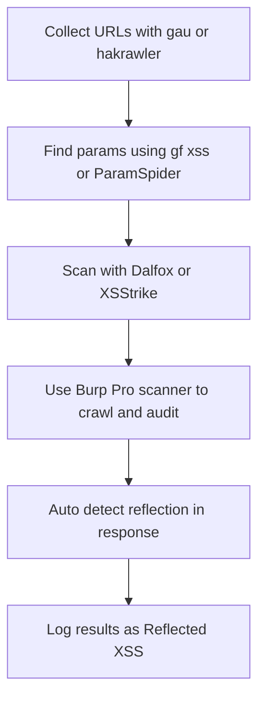

### 2. Fully Manual

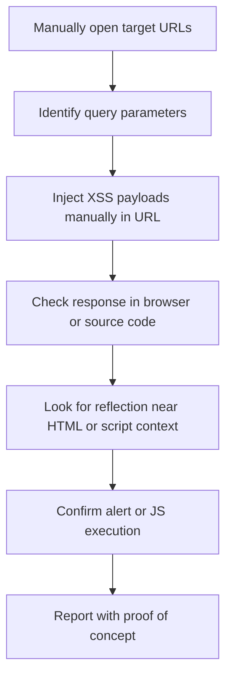

### 3. Semi-Automated

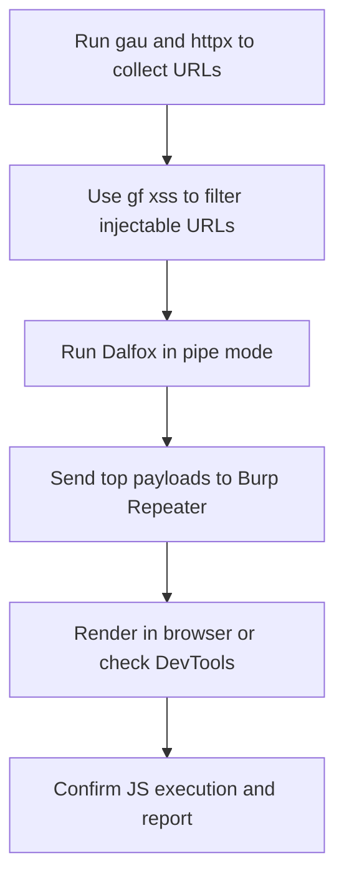

---

## 🗃️ Stored XSS Pipelines

### 1. Fully Automated

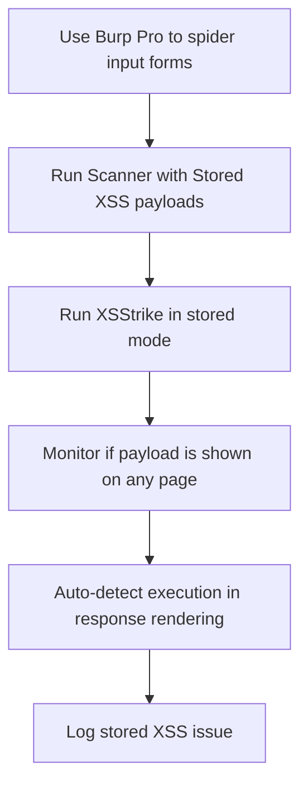

### 2. Fully Manual

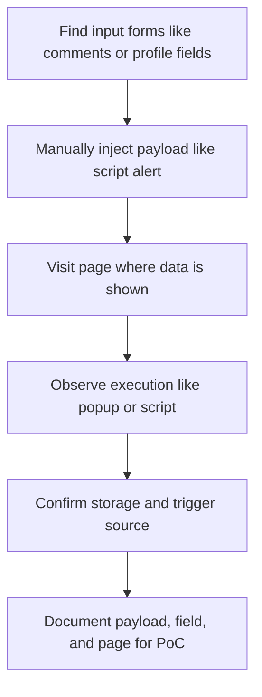

### 3. Semi-Automated

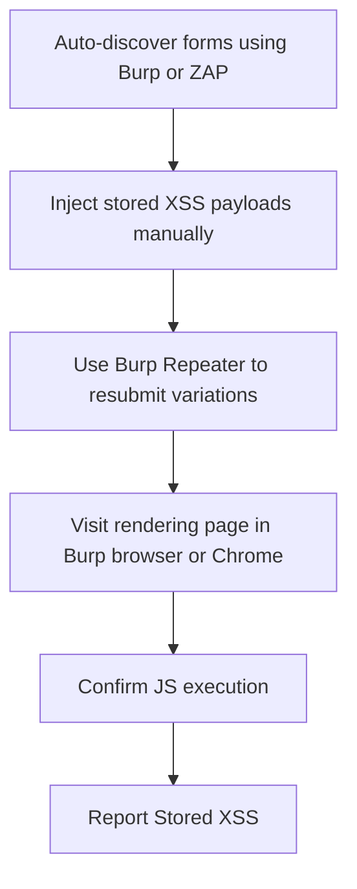

---

## 🧠 DOM-based XSS Pipelines

### 1. Fully Automated

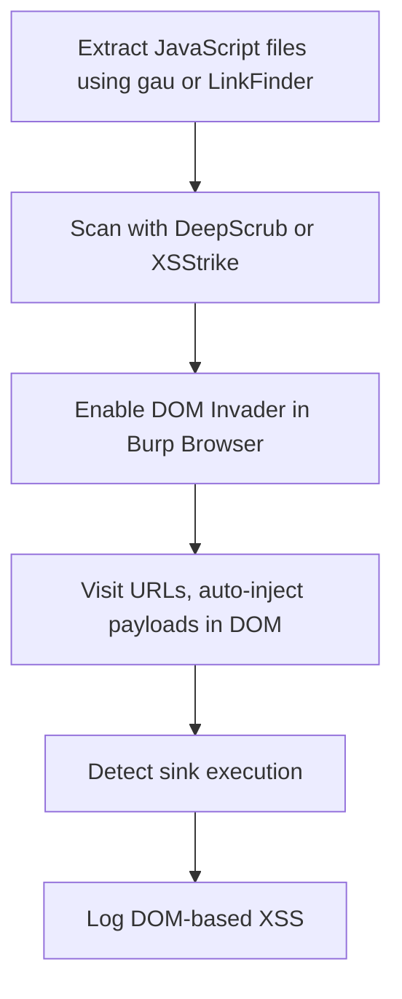

### 2. Fully Manual

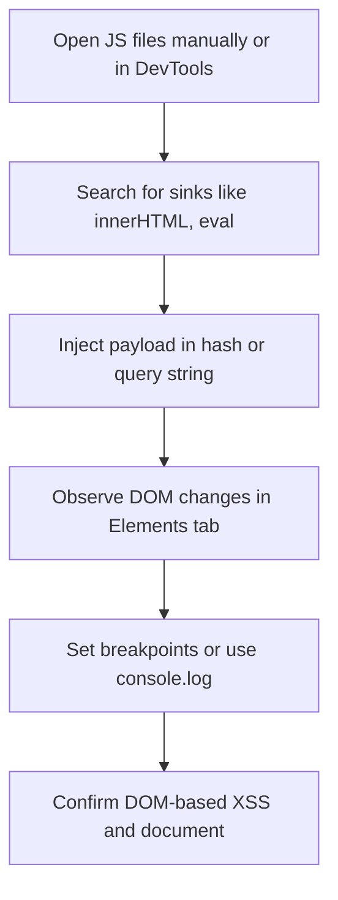

### 3. Semi-Automated

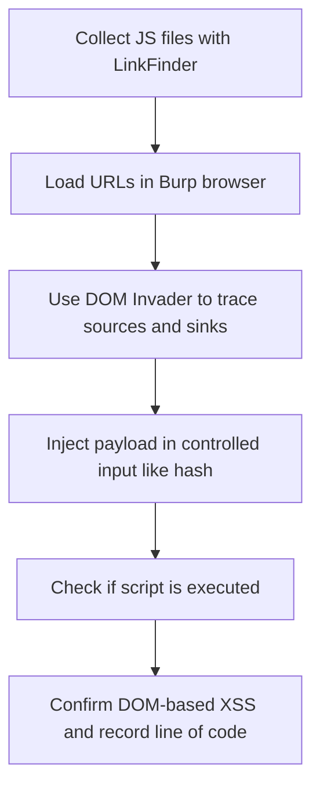

---

## 🕵️ Blind XSS Pipelines

### 1. Fully Automated

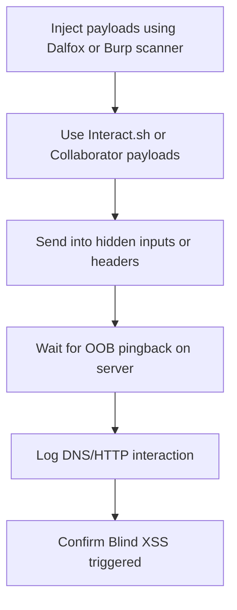

### 2. Fully Manual

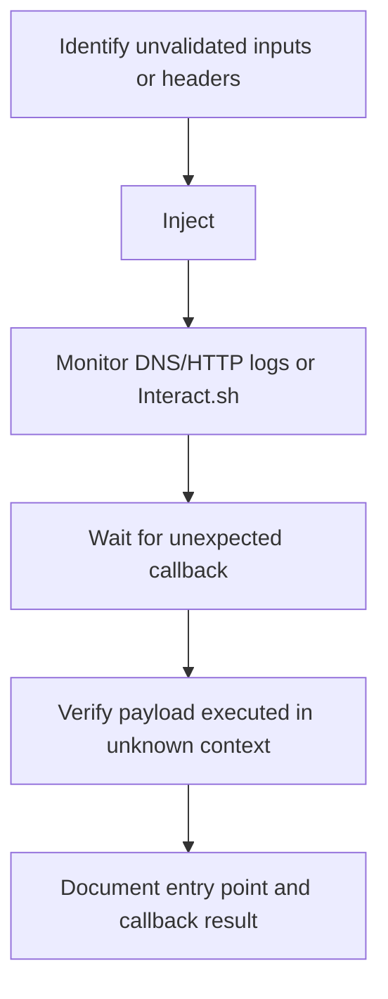

### 3. Semi-Automated

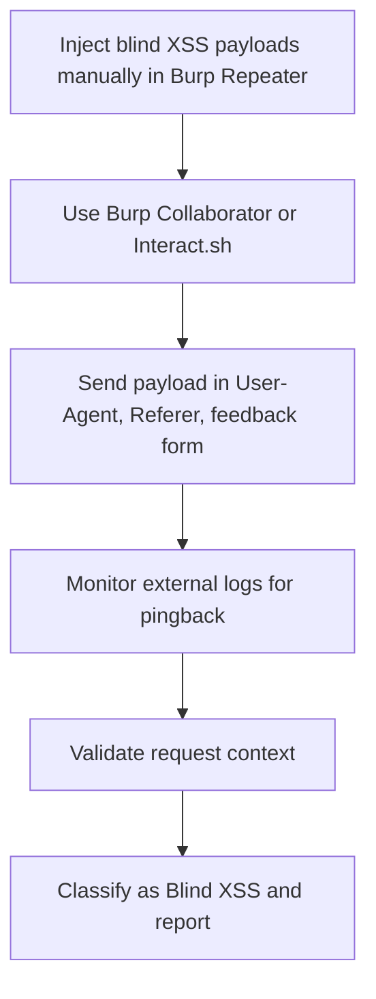

---

## ✅ Summary: Each Type Covered with 3 Pipelines

|XSS Type|Fully Automated|Fully Manual|Semi-Automated|
|---|---|---|---|
|Reflected|Dalfox, Burp, XSStrike|DevTools + Burp Repeater|Dalfox + Manual Rendering|
|Stored|Burp Scanner, XSStrike|Manual Injection + Visit|Burp Spider + Manual Review|
|DOM-based|DeepScrub, DOM Invader|DevTools + Breakpoints|Burp Browser + Manual Analysis|
|Blind|Interact.sh + Scanner|Manual Callback + Logs|Repeater + Interact.sh Monitoring|

---

Let me know if you'd like:

- All of this combined into one `.md` file
- A visual `.pdf` with icons
- A printable XSS testing playbook cheat sheet ✅