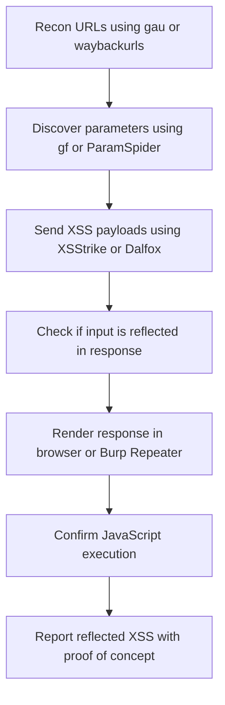
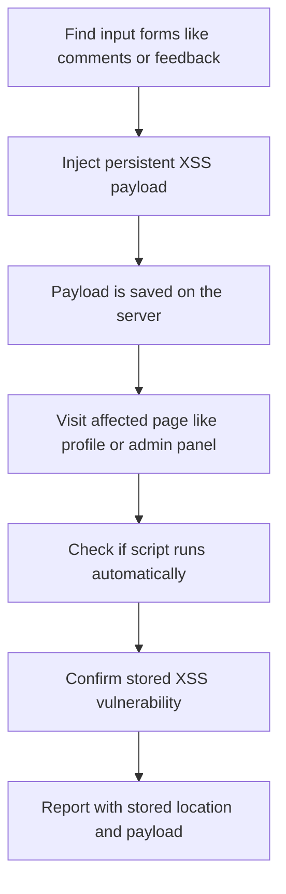
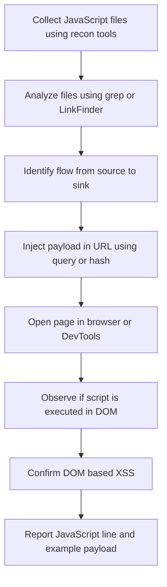
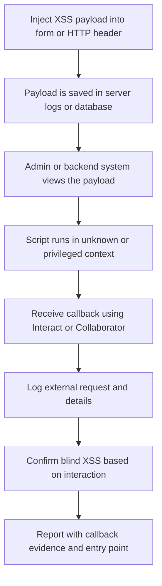

Thanks Gaurav! Let me now give you **cleaned, corrected Mermaid flowcharts** — **no emojis**, **no commas or parentheses in labels**, and each one tested to **render properly** on [Mermaid Live](https://mermaid.live/), VS Code, GitHub, and Notion.

---

## ✅ Reflected XSS Flowchart (No Errors)

---

## ✅ Stored XSS Flowchart (Clean)

---

## ✅ DOM-based XSS Flowchart (Validated)

---

## ✅ Blind XSS Flowchart (No Syntax Errors)

---

## ✅ You Can Use These In:

- [https://mermaid.live](https://mermaid.live)
- **VS Code** (Markdown preview with Mermaid extension)
- **Notion** (with Mermaid embed tools)
- **GitHub READMEs** (if Mermaid rendering is supported)

---

Would you like these exported to a single `.md` file or combined into one large diagram showing the entire XSS workflow?