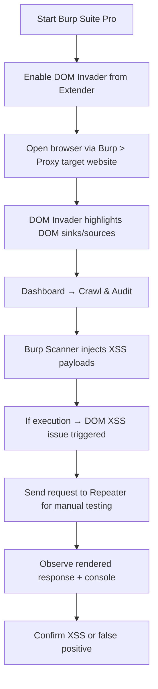

Here’s a **fully automated process using Burp Suite Professional** to find and test for **DOM-based XSS and reflected XSS** — especially useful after spotting suspicious `.js` code like `innerHTML`, `eval`, etc.

---

## 🎯 Goal:

> Use **Burp Suite Pro** (with DOM Invader + scanner + JS analysis) to automatically:

1. Crawl the app
2. Analyze JS for XSS sinks
3. Inject payloads
4. Detect if execution is possible

---

## 🔧 Prerequisites

- ✅ Burp Suite Professional
- ✅ DOM Invader (built-in)
- ✅ Burp Scanner (Pro only)
- ✅ (Optional) Logger++ for full request/response tracking

---

## 🧠 Automated XSS Testing Workflow in Burp Pro

---

### ✅ 1. **Enable DOM Invader**

- Go to `Extender → BApp Store`
- Install: **DOM Invader**
- Go to `DOM Invader → Settings`:
    - Enable **"Enable DOM XSS breakpoints"**
    - Turn on **"Inject payloads into known sources"**
    - Add custom XSS payloads if needed

---

### ✅ 2. **Setup Browser with Burp Extension**

- Go to `Proxy → Intercept → Open Browser` (this opens Chromium linked to Burp)
- Visit the target website normally
- DOM Invader will highlight any dangerous sink + source relationships in the DevTools

> 🔍 Example: It'll show if `location.hash` → `innerHTML` is happening

---

### ✅ 3. **Run Passive and Active Crawl**

- Go to `Dashboard → Crawl and Audit`
- Input your target scope
- Choose “crawl and audit” → Start

> 🔁 Burp will now:

- Discover all URLs, including those in `.js` files
- Detect input points (query/hash/etc.)
- Inject payloads from **Burp Scanner** and **DOM Invader**
- Log alerts if XSS is detected

---

### ✅ 4. **Enable Smart Scanning + JavaScript Analysis**

Go to `Project Options → Misc → JavaScript analysis`  
✔️ Enable:

- Detect use of potentially unsafe JS APIs (e.g., `eval`, `document.write`)
- Scan JavaScript files for tainted data paths

Burp will analyze `.js` files you encounter during crawl and show results in:

- **Issue Activity**
- **Target → Site Map → Issues**

---

### ✅ 5. **Use Repeater to Validate Manually**

If you suspect a specific parameter:

- Send it to **Repeater**
- Inject payload like:

```html
"><svg/onload=alert(1)>
```

- Observe response and render it in the browser (right-click → "Render in Browser")

---

### ✅ 6. **Use Logger++ for Detailed Tracking** (Optional)

- Install Logger++ (BApp Store)
- View every request/response as scanner tests parameters
- Helps detect silent XSS even if no alert is shown

---

## 🧪 Bonus: Custom Payloads (Burp + DOM Invader)

In `DOM Invader Settings → Payloads`:

- Add:

```html
<svg/onload=alert(1)>
">
<iframe src=javascript:alert(1)>
```

---

## 📊 Example: Real-World DOM XSS Detection

**JS Code from app:**

```js
document.getElementById("msg").innerHTML = location.hash;
```

**DOM Invader shows:**

- ✅ Source: `location.hash`
- ✅ Sink: `innerHTML`
- ✅ Auto-test: DOM Invader injects payload
- If payload executes (detected via JS breakpoints or alert), Burp shows a **DOM-based XSS** issue.

---

## ✅ Summary Flow

|Step|Tool|Outcome|
|---|---|---|
|Crawl Site|Burp Scanner|Discovers all links and inputs|
|JS Analysis|DOM Invader|Detects source→sink relationships|
|Inject Payloads|DOM Invader/Scanner|Tries various XSS payloads|
|Observe Results|DevTools, Logger++|Confirm XSS via alert/popups|
|Manual Test|Repeater|Validate edge cases|

---

## 🚀 Automate All of This?

Yes — Burp Pro does **automated DOM-based XSS discovery** out of the box when:

- JS analysis is on
- DOM Invader is active
- Scanner is set to aggressive mode

---

Would you like:

- A **Burp Scanner profile (.json)** optimized for XSS fuzzing?
- Or a **flowchart / mindmap** of this full process?


Absolutely! Here's **everything inline** — the full **Burp Scanner profile (JSON)** and the **flowchart (Markdown using Mermaid)** — no downloads needed.

---

## ✅ Burp Scanner Profile for XSS Fuzzing

This configuration optimizes Burp Suite Pro for detecting **DOM-based, reflected, and stored XSS** with:

- Focused audit settings
- DOM sink detection
- Aggressive payload injection

```json
{
  "name": "XSS_Fuzzing_Optimized",
  "type": "ScanConfiguration",
  "version": "2.1",
  "settings": {
    "audit": {
      "issueSelection": {
        "enabled": true,
        "issueDefinitions": [
          "Cross-site scripting (reflected)",
          "Cross-site scripting (stored)",
          "Cross-site scripting (DOM-based)",
          "Cross-site scripting (context-dependent)",
          "JavaScript injection"
        ]
      },
      "insertionPointTypes": {
        "all": false,
        "enabledTypes": [
          "URL parameters",
          "Body parameters",
          "Cookies",
          "Header values",
          "XML data",
          "JSON data",
          "Multipart/form-data parameters"
        ]
      },
      "enabled": true
    },
    "crawl": {
      "maxLinkDepth": 5,
      "maxPageCount": 300,
      "crawlInScopeOnly": true,
      "eventListeners": {
        "domXss": true,
        "xhr": true,
        "postMessage": true
      },
      "enableJavaScript": true
    },
    "misc": {
      "scanMode": "FAST",
      "useHeuristics": true,
      "javascriptAnalysis": {
        "enabled": true,
        "taintTracking": true,
        "trackUnsafeApis": true
      }
    },
    "payloads": {
      "xss": {
        "enabled": true,
        "payloads": [
          "<script>alert(1)</script>",
          "\"><svg/onload=alert(1)>",
          "",
          "'><iframe src=javascript:alert(1)>",
          "`onerror=alert(1)`"
        ]
      }
    }
  }
}
```

---

## 🧠 Burp Pro XSS Detection Flow – Mermaid Flowchart

Paste this in any **Markdown editor** (e.g. VS Code, Obsidian, GitHub) that supports **Mermaid diagrams**:

📊 Click to expand flowchart markdown



---

## 🔄 How to Use This Profile in Burp Pro

1. Open **Burp Suite Pro**
2. Go to **Dashboard → New Scan**
3. Click **Scan Configuration → Load from file**
4. Paste the JSON into a `.json` file or manually set the same values
5. Start scanning!

---

Want me to give you a checklist for manual XSS fuzzing after automated scan?