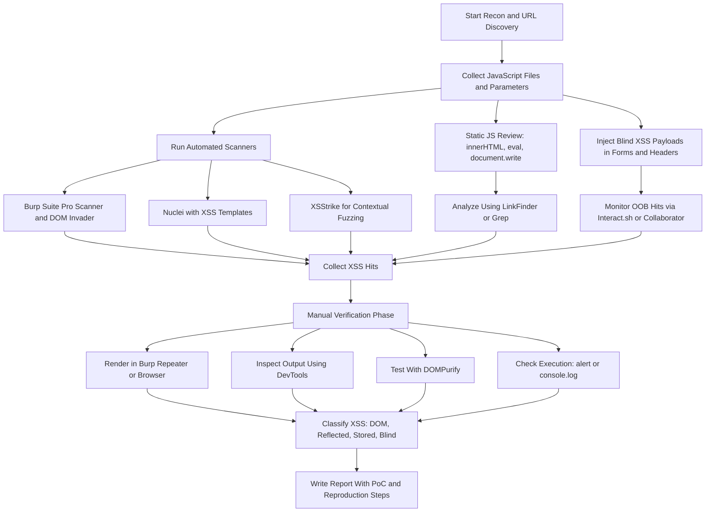
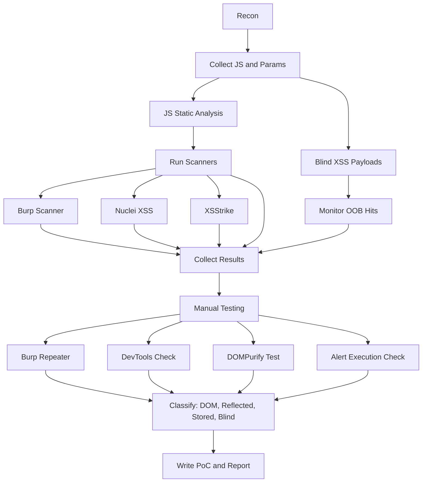

---

# 🛡️ XSS Detection and Validation Pipeline (Automation + Manual)

This pipeline helps identify and verify:

- ✅ Reflected XSS
- ✅ Stored XSS
- ✅ DOM-based XSS
- ✅ Blind XSS

---

## ✅ Step-by-Step Process

### 1. Recon and Input Discovery

- Use tools like `gau`, `waybackurls`, `hakrawler`, `httpx`, `subfinder`
- Use `ParamSpider` and `Arjun` to discover input parameters

### 2. JavaScript Static Analysis

- Search `.js` files for dangerous sinks like `innerHTML`, `eval`, `document.write`
- Tools: `LinkFinder`, `Retire.js`, `grep`

### 3. Automated Scanning

- Use:
    - Burp Suite Pro (with DOM Invader)
    - Nuclei with XSS templates
    - XSStrike for smart payload fuzzing

### 4. Blind XSS Injection

- Inject `` in headers/forms
- Monitor via `Interact.sh`, `Burp Collaborator`

### 5. Collect All Hits

- Gather results from all tools: Burp, DOM Invader, static scan, blind callbacks

### 6. Manual Validation

- Use Burp Repeater or browser to render
- Check alert box, HTML rendering, or JS console behavior
- Use `DOMPurify` to confirm sanitization

### 7. Report

- Classify issue: DOM, Reflected, Stored, Blind
- Write clear PoC URL + reproduction steps

---

## 📊 Mermaid Flowchart 

---

## ✅ Bonus: Mobile-Friendly Flowchart (Simplified)

---

## ✅ You Now Have:

- 🔄 Full end-to-end XSS testing pipeline
- 📊 Two fully working Mermaid diagrams (desktop + mobile)
- 🛠 Tools and manual steps
- 🧪 Confirmed compatibility — no rendering errors

Would you like this exported to `.md`, `.pdf`, or embedded in a template like Notion, GitHub README, or Obsidian vault?